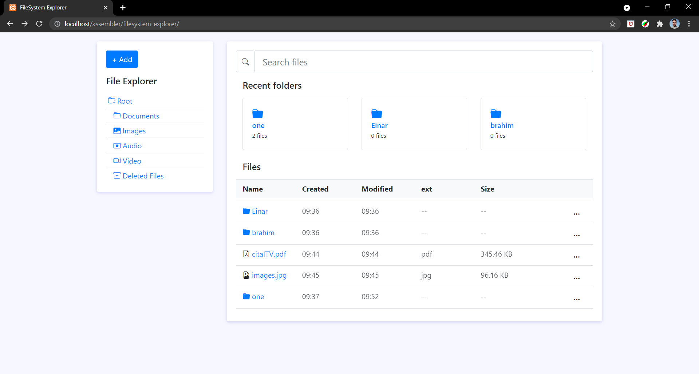

`#html` `#css` `#js` `#php` `#master-in-software-engineering`

# PHP Local FileSystem explorer <!-- omit in toc -->

<p>
  
</p>

## Index <!-- omit in toc -->
- [Getting started](#getting-started)
  - [Prerequisites](#prerequisites)
  - [Installing](#installing)
- [Branches naming strategy](#branches-naming-strategy)
- [Tests](#tests)
- [Libraries](#libraries)
- [Technologies used](#technologies-used)
- [Resources](#resources)
- [License](#license)
- [Contributors ✨](#contributors-)

## Getting started
This project was made to learn how to create a system file explorer that allows the user to navigate, create directories and upload files in the same way as he would in his usual operating system. 

### Prerequisites
First, you need XAMPP, you can download it from [here](https://www.apachefriends.org/es/index.html).

You also need the latest version of PHP. We currently use PHP 8

### Installing
Clone this project in your htdocs folder:

```
git clone https://github.com/imalovelyghost/filesystem-explorer.git
```

## Branches naming strategy
- main: includes the main product
- `F/<number>`: a feature implementation branch
- `D/<number>`: a document branch

## Tests
There are yet no tests for this project.

## Libraries
\* Magnific-Popup

\* Bootstrap

\* Bootstrap Icons

\* LineIcons

## Technologies used
\* HTML

\* CSS

\* jQuery v3.6

\* PHP v8

## Resources
- [File system](https://es.wikipedia.org/wiki/Administrador_de_archivos)
- [PHP FileSystem W3C](https://www.w3schools.com/php/php_ref_filesystem.asp)
- [PHP FileSystem Oficial](https://www.php.net/manual/es/book.filesystem.php)
- [README Guidelines Example](https://gist.github.com/PurpleBooth/109311bb0361f32d87a2)

## License
This project is licensed under the MIT License - see the [LICENSE](LICENSE) file for details

## Contributors ✨
Thanks goes to these wonderful people([emoji key](https://allcontributors.org/docs/en/emoji-key)):

<!-- ALL-CONTRIBUTORS-LIST:START - Do not remove or modify this section -->
<!-- prettier-ignore-start -->
<!-- markdownlint-disable -->
<table>
  <tr>
   <td align="center"><a href="https://github.com/imalovelyghost"><br /><sub><b>imalovelyghost</b></sub></a><br /><a href="https://github.com/imalovelyghost/filesystem-explorer/commits?author=imalovelyghost" title="Code">💻</a> <a href="#design-imalovelyghost" title="Design">🎨</a> <a href="#ideas-imalovelyghost" title="Ideas, Planning, & Feedback">🤔</a> <a href="#projectManagement-imalovelyghost" title="Project Management">📆</a></td>

   <td align="center"><a href="https://github.com/bbenalia"><br /><sub><b>bbenalia</b></sub></a><br /><a href="https://github.com/imalovelyghost/filesystem-explorer/commits?author=bbenalia" title="Code">💻</a> <a href="#design-bbenalia" title="Design">🎨</a> <a href="#ideas-bbenalia" title="Ideas, Planning, & Feedback">🤔</a> <a href="#projectManagement-bbenalia" title="Project Management">📆</a></td>
  </tr>
</table>

<!-- markdownlint-restore -->
<!-- prettier-ignore-end -->
<!-- ALL-CONTRIBUTORS-LIST:END -->

This project follows the [all-contributors](https://github.com/all-contributors/all-contributors) specification. Contributions of any kind welcome!